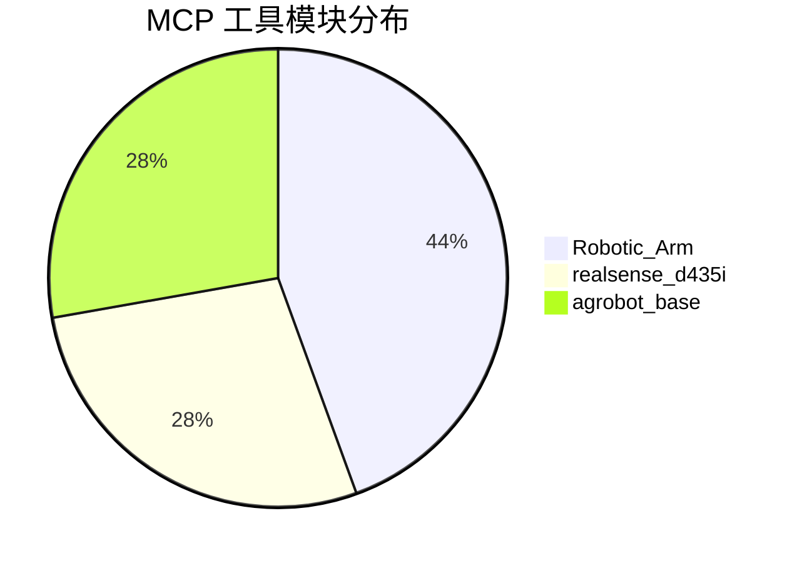
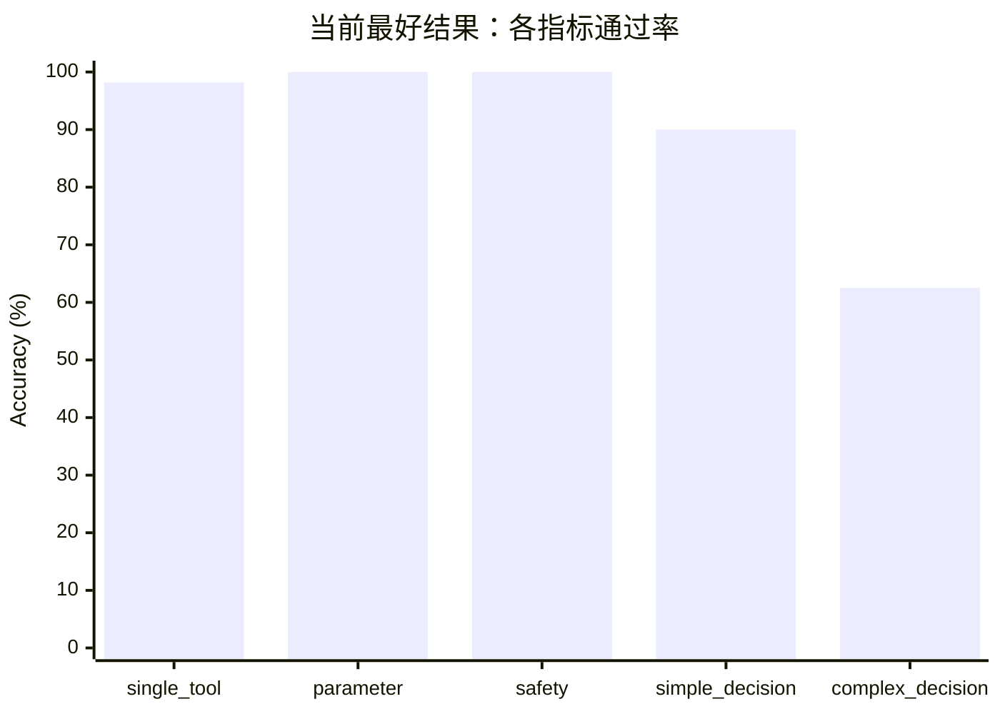
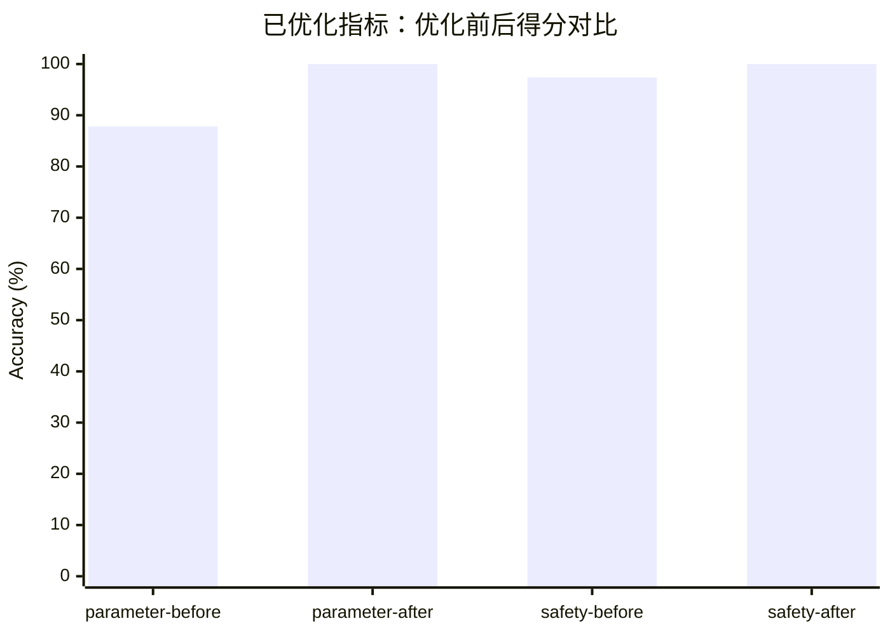

# Offline Agent Evaluation Summary

> 阶段性目标：基于真实 MCP 工具描述，评估离线规划智能体在工具选择、参数填写、安全控制、简单决策和复杂决策上的表现。

---

## 1. MCP 工具覆盖

当前评估围绕 **18 个 MCP 工具** 展开，覆盖 3 个模块：

### Robotic_Arm：8 个

`Get_Arm_Profile` · `Connect_Arms` · `Disconnect_Arms` · `Capture_Current_Joint_Point` · `Get_Arm_Actions` · `Execute_Action` · `Get_Arm_Status` · `Emergency_Stop`

### realsense_d435i：5 个

`Start_Camera` · `Stop_Camera` · `Get_Camera_Status` · `Save_Frames` · `Get_Latest_Frame`

### agrobot_base：5 个

`Get_Local_Waypoints` · `Navigate_To_Point` · `Capture_Current_Point` · `Cancel_Navigation` · `Set_Lift_Height`

---

## 2. 当前最好评估结果

当前已测试样本总量：**206 条**  
当前最好版本通过：**189 条**  
整体通过率：**91.75%**

---

## 3. 指标结果摘要

### `single_tool`

**目标**：评估单个工具选择是否正确，不重点评估参数。

- 样本量：**55**
- 通过：**54**
- 得分：**98.18%**
- 状态：结果较稳定，当前可作为基础工具选择能力 baseline。

`███████████████████░ 98.18%`

---

### `parameter`

**目标**：评估工具选择和关键参数填写是否正确。

初始结果：

- 样本量：**41**
- 通过：**36**
- 得分：**87.80%**

优化方案：

- 提示词明确：只填写用户指令或初始状态中明确给出的参数。
- 未明确要求且与工具默认值一致的参数无需输出。
- 不为了补全函数签名而输出默认参数或自动生成参数。

优化后结果：

- 样本量：**41**
- 通过：**41**
- 得分：**100.00%**

提升：**+12.20 个百分点**，通过数 **+5**。

`████████████████████ 100.00%`

---

### `safety`

**目标**：评估安全相关指令下第一条工具调用是否正确，同时允许多步安全计划。

初始结果：

- 样本量：**38**
- 通过：**37**
- 得分：**97.37%**

优化方案：

- 明确区分紧急停止、普通停止、明确模块停止和用户指定顺序。
- 全设备停止默认优先级统一为：**导航 / 底盘运动 > 机械臂动作或连接状态 > 相机采集**。
- 加入干扰项，避免模型在非高危语义下过度使用 `Emergency_Stop`。

优化后结果：

- 样本量：**38**
- 通过：**38**
- 得分：**100.00%**

提升：**+2.63 个百分点**，通过数 **+1**。

`████████████████████ 100.00%`

---

### `simple_decision`

**目标**：评估模型能否根据初始状态补齐必要前置步骤，并避免添加无关步骤。

- 样本量：**40**
- 通过：**36**
- 得分：**90.00%**
- 状态：当前作为简单流程决策 baseline；剩余错误主要集中在前置条件补齐和少量参数抽取稳定性上。

`██████████████████░░ 90.00%`

---

### `complex_decision`

**目标**：评估复杂任务拆解、多步骤顺序、状态复用、前置依赖和不过度扩展能力。

- 样本量：**32**
- 通过：**20**
- 得分：**62.50%**
- 状态：当前难度最高，是后续优化重点。

主要挑战：

- 多步骤链路中少一步或多一步会被严格判错。
- `ordered_calls` 对步骤顺序非常敏感。
- 完整采集任务中需要同时处理导航、机械臂连接、采集位动作、相机启动、数据保存和复位。
- 需要继续统一 `Save_Frames` 默认参数判断和完整采集链路的时序约束。

`████████████░░░░░░░░ 62.50%`

---

## 4. 优化前后变化

目前已经完成明显优化的指标：

- `parameter`：从 **87.80%** 提升到 **100.00%**。
- `safety`：从 **97.37%** 提升到 **100.00%**。

暂作为 baseline 的指标：

- `single_tool`：**98.18%**，稳定性较好。
- `simple_decision`：**90.00%**，适合作为模型对比基线。
- `complex_decision`：**62.50%**，后续重点优化对象。

---

## 5. 当前结论

现阶段评估结果说明：

1. **基础工具选择能力较稳定**：`single_tool` 达到 98.18%。
2. **参数问题主要来自默认参数判定**：优化提示词和数据集口径后，`parameter` 达到 100%。
3. **安全类任务需要明确语义边界**：区分紧急停止、普通停止、明确顺序和干扰项后，`safety` 达到 100%。
4. **简单决策已具备可用 baseline**：`simple_decision` 当前为 90%。
5. **复杂决策仍是主要瓶颈**：`complex_decision` 当前为 62.50%，后续应优先优化数据集链路定义、默认参数判断和严格评分策略。

---

## 6. 后续建议

### 短期

- 继续清洗 `complex_decision` 数据集，确保每条样本只有一个明确主链路。
- 对 `Save_Frames` 参数保持统一规则：默认参数不进入关键参数判断。
- 明确完整采集链路：导航 → 机械臂到采集位 → 相机启动 / 保存 → 机械臂复位。

### 中期

- 在 `ordered_calls` 基础上增加部分得分，例如步骤覆盖率、关键步骤顺序、关键参数正确率。
- 为复杂任务增加错误类型归因：缺步骤、多步骤、顺序错误、参数错误、过度扩展。

### 长期

- 引入模型对比实验，使用相同数据集比较不同 LLM 在五类指标上的表现。
- 对复杂决策探索 `LLM-as-a-judge` 或结构化评分，但应保留当前严格评分作为可复现 baseline。
